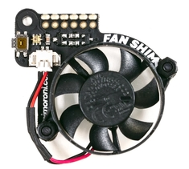

# Azure IoT Edge on Raspberry Pi Buster plus tips for Raspberry Pi 4


## Useful References

1. [Azure IoT Edge](https://azure.microsoft.com/services/iot-edge?WT.mc_id=iot-0000-dglover)
2. [Azure Custom Vision](https://azure.microsoft.com/services/cognitive-services/custom-vision-service?WT.mc_id=iot-0000-dglover)

## Raspberry Pi 4

If you are anything like me, then you too couldn't resist the Raspberry Pi 4 4GB goodness. I wanted to improve the inference performance of my favourite Machine Learning project - [Creating an image recognition solution with Azure IoT Edge and Azure Cognitive Services](https://dev.to/azure/creating-an-image-recognition-solution-with-azure-iot-edge-and-azure-cognitive-services-4n5i).

As a rough guide, the inference performance of my [Azure Custom Vision](https://azure.microsoft.com/services/cognitive-services/custom-vision-service/?WT.mc_id=iot-0000-dglover) model was as follows:

1. Raspberry Pi 4 4GB - 720 Milliseconds
2. Raspberry Pi 3B Plus - 1.2 Seconds
3. Intel Core i5-8250U (Surface Laptop 2) - 230 Milliseconds

## Raspbian Buster

With the release of the [Raspberry Pi 4](https://www.raspberrypi.org/) the Raspberry Pi Foundation has moved from Raspbian Stretch to Buster (Debian 10) as the default Linux distribution for all Raspberry Pis. For now, at least, it's busted a few things. So here are some tips and tricks for running [Azure IoT Edge](https://docs.microsoft.com/azure/iot-edge/how-to-install-iot-edge-linux?WT.mc_id=iot-0000-dglover) on a Raspberry Pi running Raspbian Buster.

## Installing Raspbian Buster

This article is not intended as a guide to getting started with Raspberry Pi or Azure IoT Edge. For more information on those topics then read the following articles.

1. My [Creating an image recognition solution with Azure IoT Edge and Azure Cognitive Services](https://dev.to/azure/creating-an-image-recognition-solution-with-azure-iot-edge-and-azure-cognitive-services-4n5i) project is a great place to get started with Azure IoT Edge.

2. I typically run Raspbian Lite (Headless). Check out this guide "[HEADLESS RASPBERRY PI 3 B+ SSH WIFI SETUP (MAC + WINDOWS)](https://desertbot.io/blog/headless-raspberry-pi-3-bplus-ssh-wifi-setup)".

## Azure IoT Edge on Raspbian Buster

### Raspberry Pi 4 Tips

1. [Cooling your Raspberry Pi 4](#cooling-your-raspberry-pi-4)
2. [Booting your Raspberry Pi 4 from USB 3 Flash or SSD drive](#booting-from-a-usb-3-flash-or-ssd-drive)

### Azure IoT Edge and Raspbian Buster Tips

1. [Installing Docker on Raspbian Buster](#installing-docker-on-raspbian-buster)
2. [Installing Azure IoT Edge on Raspbian Buster](#installing-azure-iot-edge-on-raspbian-buster)

## Cooling your Raspberry Pi 4

The Raspberry Pi 4 runs hot and you will likely need to provide some active cooling to prevent thermal throttling.

I like the Pimoroni case and [Fan SHIM](https://shop.pimoroni.com/products/fan-shim), it is a nice compact solution. Note, I have no affiliation with Pimoroni, I'm just a fan (pun intended). There are other cool solutions for Raspberry Pi 4 too. Check out the [Raspberry Pi 4 Thermals and Fan Shim](https://blog.pimoroni.com/raspberry-pi-4-thermals-and-fan-shim/) article.



### Install the Fan SHIM Software

Check out the [Getting Started with Fan SHIM](https://learn.pimoroni.com/tutorial/sandyj/getting-started-with-fan-shim) article. In summary, install git and pip3 support, clone the Fan SHIM GitHub repo, install the dependencies, and then set up the automatic temperature monitor service that turns the fan on as required.

```bash
sudo apt install -y git sudo python3-pip && \
git clone https://github.com/pimoroni/fanshim-python && \
cd fanshim-python && \
sudo ./install.sh && \
cd examples && \
sudo ./install-service.sh --on-threshold 65 --off-threshold 55 --delay 2
```

## Booting from a USB 3 Flash or SSD Drive

The benefit of booting from USB 3 depends on how disk IO intensive your Azure IoT Edge Solution is. The Raspberry Pi 4 introduces vastly improved USB support and disk IO performance is impressive when combined with a USB 3 SSD drive. Check out the [USB 3 Flash and SSD Disk Performance](#usb-3-flash-and-ssd-disk-performance) numbers I recorded.

You can't directly boot from USB 3 (yet), but you can boot from sd-card and then load the Operating System from USB.

In summary, create the boot sd-card as usual, then copy the OS files to the USB 3 drive, tweak the /boot/cmdline.txt to load the Operating System from the USB 3 drive. For step by step instructions follow the notes at [How to Run Raspberry Pi 4 or 3 Off an SSD or Flash Drive](https://www.tomshardware.co.uk/boot-raspberry-pi-from-usb,news-61081.html)

1. Plug in your USB 3 drive, then list your drives. If you only plugged in one USB drive then it's highly likely your drive with be /dev/sda.

```bash
sudo fdisk -l
```

2. Delete existing partitions and create a new primary partition on the USB drive.

```bash
sudo fdisk /dev/sda
```

    **fdisk commands**

    - p = print partitions
    - d = delete a partition
    - n = new partition - create a primary partition
    - w = write the partition information to disk

3. Format the newly created partition

```bash
sudo mkfs.ext4 /dev/sda1
```

4. Create a mount point, mount the USB 3 drive, copy the Operating System files to the USB drive, and amend the cmdline.txt to enable booting from the USB 3 drive

```bash
sudo mkdir /media/usbdrive && \
sudo mount /dev/sda1 /media/usbdrive && \
sudo rsync -avx / /media/usbdrive && \
sudo sed -i '$s/$/ root=\/dev\/sda1 rootfstype=ext4 rootwait/' /boot/cmdline.txt
```

5. Reboot the Raspberry Pi

```bash
sudo reboot
```

## Installing Docker on Raspbian Buster


The Azure IoT Edge recommended container runtime is the Moby based engine. For now, Moby doesn't install on Buster, so instead, install Docker-ce.

You need to download the latest versions of **containerd.io**, **docker-ce-cli**, and **docker-ce** from [Docker (armhf) on Buster](https://download.docker.com/linux/debian/dists/buster/pool/stable/armhf).

An easy way to download the files to the Raspberry Pi is from your browser right mouse click the file and copy the link address and then in an SSH session to the Raspberry Pi **wget** each file.

```bash
wget https://download.docker.com/linux/debian/dists/buster/pool/stable/armhf/containerd.io_<LATEST VERSION>_armhf.deb

wget https://download.docker.com/linux/debian/dists/buster/pool/stable/armhf/docker-ce-cli_<LATEST VERSION>~debian-buster_armhf.deb

wget https://download.docker.com/linux/debian/dists/buster/pool/stable/armhf/docker-ce_<LATEST VERSION>~debian-buster_armhf.deb
```

Install the debian packages in the same order you downloaded, add the current user to the docker group, and reboot.

```bash
sudo dpkg -i containerd.io* && \
sudo dpkg -i docker-ce-cli* && \
sudo dpkg -i docker-ce_* && \
sudo usermod -aG docker $USER && \
sudo reboot
```

## Installing Azure IoT Edge on Raspbian Buster


Review how to [Install the Azure IoT Edge runtime on Debian-based Linux systems](https://docs.microsoft.com/azure/iot-edge/how-to-install-iot-edge-linux?WT.mc_id=iot-0000-dglover).

### SSL Library libssl1.0.2

Buster does not ship with the require libssl1.0.2 library. As an interim workaround install this library before installing IoT Edge.

```bash
sudo apt-get install libssl1.0.2
```

```bash
curl https://packages.microsoft.com/config/debian/stretch/multiarch/prod.list > ./microsoft-prod.list && \
sudo cp ./microsoft-prod.list /etc/apt/sources.list.d/ && \
curl https://packages.microsoft.com/keys/microsoft.asc | gpg --dearmor > microsoft.gpg
sudo cp ./microsoft.gpg /etc/apt/trusted.gpg.d/ && \
sudo apt-get update && \
sudo apt-get -y install iotedge
```

### Add IoT Edge Connection String

```bash
sudo nano /etc/iotedge/config.yaml
```

### Restart Azure IoT Edge

```bash
sudo systemctl restart iotedge
```

## SSH Authentication with private/public keys


Setting up public/private keys for SSH login and authentication is very handy (and secure).

The following creates a new SSH key, copies the public key to the Raspberry Pi. Take the default options.

### From Windows

1. Use the built-in Windows 10 (1809+) OpenSSH client. First install the OpenSSH Client for Windows (one time only operation).

    From **PowerShell as Administrator**.

```bash
Add-WindowsCapability -Online -Name OpenSSH.Client
```

2. From PowerShell, create a key pair.

```bash
ssh-keygen -t rsa
```

3. From PowerShell, copy the public key to your Raspberry Pi

```bash
cat ~/.ssh/id_rsa.pub | ssh pi@raspberrypi.local "mkdir -p ~/.ssh; cat >> ~/.ssh/authorized_keys"
```

### From Linux, macOS, and the Windows Subsystem for Linux

1. Create your key. Typically a one time operation.

```bash
ssh-keygen -t rsa
```

2. Copy the public key to your Raspberry Pi. From Linux and macOS.

```bash
ssh-copy-id pi@raspberrypi.local
```

## Tools


Torrent Tool for Windows (fastest way to download Raspbian Images)

- [qBittorrent](https://www.qbittorrent.org/download.php) Windows Torrent Utility for fast download of Raspbian Images
- Burn Raspbian to sd card with [Balena Etcher](https://www.balena.io/etcher)
- [Raspberry Pi Storage Benchmarks 2019](https://www.raspberrypi.org/forums/viewtopic.php?t=31925)

## USB 3 Flash and SSD Disk Performance

For reference, these are performance stats I recorded for various drives using the performance tool found at [Raspberry Pi Storage Benchmarks 2019](https://www.raspberrypi.org/forums/viewtopic.php?t=31925)

## SD Card SanDisk Ultra 16GB

```
     Category                  Test                      Result
HDParm                    Disk Read                 40.22 MB/s
HDParm                    Cached Disk Read          39.47 MB/s
DD                        Disk Write                17.8 MB/s
FIO                       4k random read            2614 IOPS (10457 KB/s)
FIO                       4k random write           296 IOPS (1186 KB/s)
IOZone                    4k read                   8669 KB/s
IOZone                    4k write                  2808 KB/s
IOZone                    4k random read            8609 KB/s
IOZone                    4k random write           1480 KB/s

                          Score: 923
```

### PNY 128

```
     Category                  Test                      Result
HDParm                    Disk Read                 98.99 MB/s
HDParm                    Cached Disk Read          70.08 MB/s
DD                        Disk Write                21.6 MB/s
FIO                       4k random read            2238 IOPS (8953 KB/s)
FIO                       4k random write           116 IOPS (464 KB/s)
IOZone                    4k read                   16067 KB/s
IOZone                    4k write                  2204 KB/s
IOZone                    4k random read            7747 KB/s
IOZone                    4k random write           461 KB/s

                          Score: 860
```

### SanDisk Ultra 64 GB

```
     Category                  Test                      Result
HDParm                    Disk Read                 551.09 MB/s
HDParm                    Cached Disk Read          77.30 MB/s
DD                        Disk Write                55.0 MB/s
FIO                       4k random read            994 IOPS (3976 KB/s)
FIO                       4k random write           312 IOPS (1250 KB/s)
IOZone                    4k read                   17479 KB/s
IOZone                    4k write                  1616 KB/s
IOZone                    4k random read            4052 KB/s
IOZone                    4k random write           1005 KB/s

                          Score: 1087
```

### ASMT - Model: 1153 - USB 3 SSD

```
     Category                  Test                      Result
HDParm                    Disk Read                 297.42 MB/s
HDParm                    Cached Disk Read          264.49 MB/s
DD                        Disk Write                69.0 MB/s
FIO                       4k random read            15019 IOPS (60076 KB/s)
FIO                       4k random write           8239 IOPS (32957 KB/s)
IOZone                    4k read                   36059 KB/s
IOZone                    4k write                  27480 KB/s
IOZone                    4k random read            20925 KB/s
IOZone                    4k random write           33354 KB/s

                          Score: 6939
```
